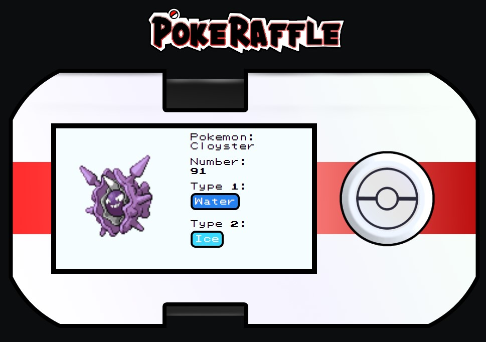

**<h1 align="center">PokeRaffle</h1>**

---

**<h2>SOBRE</h2>**

Projeto construído com intuito de estudo pratico de React/JS/HTLM/CSS e utilização para outros projetos pessoais.

> _ESCOPO_

A aplicação sorteia um Pokémon, apresentando imagem, nome, número e um tipo ou mais, caso o mesmo possua.

> _DETALHES_

**VISUAL**

- A aplicação simula um dispositivo, que possui um display onde o conteudo é apresentado e um botão, responsavel por iniciar o sorteio.

- O display inicia com uma tela de apresentação, ao sortear, a tela de apresentação é retirada. É apresentado a esqueda a imagem do Pokémon e na direita o nome, o numero e os tipos caso tenha dois.

- Os tipos são apresentados dentro de caixas onde a coloração muda de acordo com as designidas no ultimo jogo da franquia.

**FUNCIONAMENTO**

- Ao clicar no botão, um numero é gerado aleatoriamente dentro do range de números de Pokémon existentes, a aplicação busca um Pokémon dentro de uma API através do número equivalente ao mesmo e busca as informações necessarias atribuindo a variavel na aplicação para em seguida ser apresentada em tela.

- Como nem todos os Pokémon possuem dois tipos, a aplicação busca na API se o Pokémon sorteado possui uma segunda tipagem, possuindo, a aplicação atribui valor a uma variavel a parte para apresentação em tela, caso não possua, a aplicação não apresentará nada no campo do tipo 2.

- Um novo Pokémon poderá ser sorteado novamente, sem limite para realização.

**API**

- A API utilizada é uma RESTful API publica denominada [POKEAPI](https://pokeapi.co/)

---

**<h2>TECNOLOGIAS</h2>**

 HTML

 CSS

 JavaScript

 React

---

<!-- **<h2>PROJETO</h2>**

[Clique aqui para acessar o projeto;](https://nathancaleb.github.io/nlw-setup/)

--- -->

**<h2>CONTATO</h2>**

E-mail: nathancalebss@gmail.com
